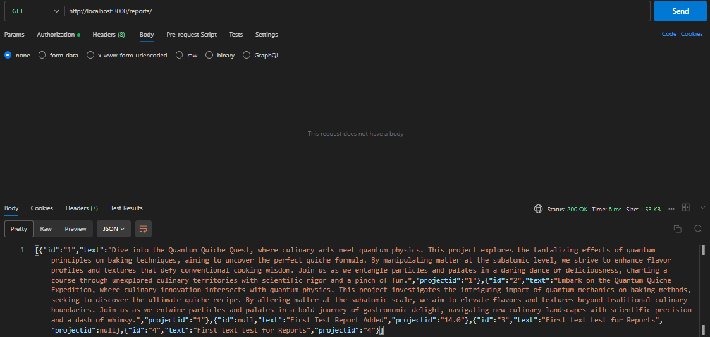

# DPS Backend Coding Challenge

This API provides endpoints to manage **Projects** and **Reports**, including CRUD operations and additional features such as retrieving reports with redundant words. Below is the detailed documentation for each endpoint and usage examples.

---

## Folder Structure


---

## API Endpoints

### **Reports API**

#### **1. Create a New Report**
- **Route:** `POST /reports/`
- **Middleware:** `authenticate`
- **Handler:** `createReport`
- **Description:** Creates a new report.
```
{ "id": "4", "text": "Some text", "projectId": "2" }
```



---

#### **2. Get Reports by Project ID**
- **Route:** `GET /reports/projectid/:projectId`
- **Middleware:** `authenticate`
- **Handler:** `getReportsByProjectId`
- **Description:** Retrieves reports associated with a specific project.


---

#### **3. Get Reports with Redundant Words**
- **Route:** `GET /reports/redondant`
- **Middleware:** `authenticate`
- **Handler:** `getAllReportsWithRedondantWords`
- **Description:** Retrieves all reports containing redundant words.


---

#### **4. Get All Reports**
- **Route:** `GET /reports/`
- **Middleware:** `authenticate`
- **Handler:** `getAllReports`
- **Description:** Retrieves all reports.


---

#### **5. Update a Report**
- **Route:** `PUT /reports/:id`
- **Middleware:** `authenticate`
- **Handler:** `updateReport`
- **Description:** Updates a specific report by its ID.

```
{ "text": "Updated text", "projectId": "2" }
```


---

#### **6. Delete a Report**
- **Route:** `DELETE /reports/:id`
- **Middleware:** `authenticate`
- **Handler:** `deleteReport`
- **Description:** Deletes a specific report by its ID.


---

### **Projects API**

#### **1. Create a New Project**
- **Route:** `POST /projects/`
- **Middleware:** `authenticate`
- **Handler:** `createProject`
- **Description:** Creates a new project.
```
{ "id": "3", "name": "New Project", "description": "Project Description" }
```


---

#### **2. Get All Projects**
- **Route:** `GET /projects/`
- **Middleware:** `authenticate`
- **Handler:** `getAllProjects`
- **Description:** Retrieves all projects.


---

#### **3. Get a Project by ID**
- **Route:** `GET /projects/:id`
- **Middleware:** `authenticate`
- **Handler:** `getProjectById`
- **Description:** Retrieves a specific project by its ID.


---

#### **4. Update a Project**
- **Route:** `PUT /projects/:id`
- **Middleware:** `authenticate`
- **Handler:** `updateProject`
- **Description:** Updates a specific project by its ID.
```
{ "name": "Updated Project Name", "description": "Updated Project Description" }
```


---

#### **5. Delete a Project**
- **Route:** `DELETE /projects/:id`
- **Middleware:** `authenticate`
- **Handler:** `deleteProject`
- **Description:** Deletes a specific project by its ID.


---

## Notes

- The project uses a hardcoded authentication token (`Password123`) for securing API routes.
- Ensure the `dps_diagram.drawio` file is in the root folder to view the folder structure diagram.
- Test examples are provided in the `/tests/` folder with screenshots for each API request.
